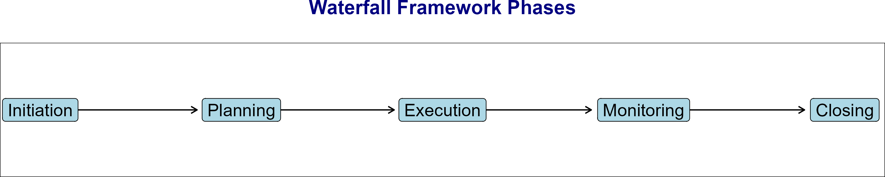

```{r setup, include=FALSE}
knitr::opts_chunk$set(echo = TRUE)
```

# Waterfall Frameworks
The waterfall project management method is a linear, step-by-step approach that's ideal for projects with a clear scope and predictable timeline. It has five phases:




Waterfall project management best suits well-defined projects with clearly specified requirements, limited complexity, and a definitive timeline.It fits projects with the following characteristics:

- Simple scope and requirement gathering
- Clear and linear sequence of tasks
- Predictable deliverables based on set deadlines
- Structured processes
- Rigid quality control measures
- Long-term commitment from all parties involved

Below is how the Data Science process fits within the Waterfall framework:

**1. Problem Definition**
The problem is clearly defined at the start. Objectives and scope are specified upfront, providing a clear roadmap for the entire project.

**2. Data Collection**
All necessary data is collected in a structured manner. Data sources are identified, and data is gathered according to the plan established in the problem definition.

**3. Data Cleaning & Preprocessing**
Data is cleaned and preprocessed before any analysis or modeling begins. This stage includes handling missing values, normalizing data, encoding categorical variables, and other preprocessing tasks necessary for model building.

**4. Modeling/Analysis**
This step follows a fixed path, and the model is designed to meet specific goals set in the problem definition phase.

**5. Evaluation**
Once the model is developed, it is evaluated against performance metrics. The evaluation phase typically happens after the model is fully built, and any adjustments based on the evaluation might require starting from earlier stages.

**6. Deployment**
After successful evaluation, the model is finalized and deployed to production. The deployment process typically happens once the model's effectiveness has been verified.

**7. Maintenance** 
After deployment, the model is maintained and updated as necessary. Regular maintenance includes monitoring its performance and making adjustments as new data becomes available or when the model's effectiveness starts to decline.

## Advantages of waterfall framework
1. Supports all planning to be completed up front with a clear roadmap for every stage of the project.
2. Project manager holds significant authority over the project, plan, and value delivery.
3. Utilizes a clear, structured approach.
4. Easy to track progress, identify risks, and manage project budgets.

## Disadvantages of waterfall framework
1. Long delivery timeline since model development and deployment occur toward the end of the project
2. Changes require significant replanning and adjustment to long-term plans.
3. Challenging to see the value of completed tasks throughout the project if only released at the end.
4. Value of projects is low until the very end, meaning any pivots cause high sunk costs vs. delivering value.

Based on the above, waterfall is well-suited for data science projects with clear and stable requirements, where changes are minimal and predictable.

# Agile Frameworks
Agile project management is a flexible and iterative approach that enables teams to quickly adapt to changing project requirements and deliver high-quality results within shorter timeframes. It’s very often used in software development.

Since it prioritizes collaboration and communication, agile processes enable teams to pivot and respond to evolving customer needs while maintaining a high level of flexibility. It is good fit in cases where the end goal may be unclear or difficult to define, when complex systems require frequent feedback loops, or when timelines and budgets are tight. 

To specify, it fits projects with the following characteristics:

 - Complex deliverables
 - Frequent iterations and refinements
 - Rapid delivery times
 - Emergent requirements
 - Collaborative environments
 - Multiple stakeholders

In data science, agile is typically used for projects where requirements are unclear, or they may evolve over time and follows the below process.

**1. Initial Planning** 
The project is broken down into smaller tasks with high-level goals. The detailed plan is developed iteratively.

**2. Data Collection & Exploration**
Data collection and exploration happen in iterative sprints, where data scientists constantly revisit and refine the dataset as they gather insights.

**3. Modeling/Analysis**
Multiple modeling techniques may be used and refined across iterations. The model is continually updated based on feedback from the business or stakeholders.

**4. Evaluation**
Models are evaluated in each sprint and adjustments are made in the following iterations based on performance or changing business needs.

**5. Deployment**
After each sprint, a prototype model is deployed and tested in production, with adjustments being made in subsequent sprints.

**6. Continuous Improvement**
Post-deployment, the model is refined as needed with continuous feedback and improvements.

## Advantages of Agile Frameworks
1. Can handle changes to requirements along the way, regardless of size.	
2. Shorter feedback loops mean faster ability to pivot.
3. Clear visibility of current/active work items and ability to see progress on tasks over time.	
4. Support for engineering discipline and upfront testing, improving quality.

## Disadvantages of Agile Frameworks
1. Requires customer involvement to allow teams to identify and analyze customer needs.
2. Project management holds little authority; focus on facilitation and process instead.
3. Iterative development may lead to engineering refactoring due to changes over time.
4. Allows for additional feature requests which may add cost or time.

# Waterfall vs Agile in Data Science

**Process Structure**:  
- *Waterfall*: Linear, sequential, and rigid.  
- *Agile*: Iterative, flexible, and adaptive.  

**Data Collection**:  
- *Waterfall*: All data is collected upfront according to a fixed plan.  
- *Agile*: Data collection is iterative, with continuous refinement based on feedback.  

**Model Development**:  
- *Waterfall*: Models are developed in phases after all requirements are clearly defined.  
- *Agile*: Model development occurs iteratively with continuous adjustments.  

**Evaluation**:  
- *Waterfall*: Evaluation happens after the model is built, typically near the end of the process.  
- *Agile*: Evaluation is ongoing throughout the project, with frequent feedback loops.  

**Feedback**:  
- *Waterfall*: Feedback is received after major milestones, such as after model deployment.  
- *Agile*: Feedback is continuous, often received every few weeks or during each sprint.  

**Flexibility**:  
- *Waterfall*: Low flexibility for changes once the project starts.  
- *Agile*: High flexibility, allowing adjustments at any stage of the project.  

**Time to Value**:  
- *Waterfall*: Longer time to deliver the final model or results.  
- *Agile*: Faster delivery of smaller results or prototypes.  

**Risk Management**:  
- *Waterfall*: Higher risk of late-stage problems due to a lack of iteration.  
- *Agile*: Lower risk, as issues are identified and addressed early in the project.  

**Team Collaboration**:  
- *Waterfall*: Less frequent collaboration across departments.  
- *Agile*: Frequent collaboration, with constant team involvement.  


# Eight ways to Modernize Your Data
The Book *Eight Ways to Modernize Your Data Management* provides strategies for leveraging artificial intelligence, handling growing data diversity, and better integrating deployments to optimize data management.The key recommendations include:

1. **Drive Optimization and App Development with AI**: AI and machine learning can optimize data management performance, speed up querying times, and spread insights throughout an organization, enhancing innovation and efficiency.

2. **Enable Rapid Reporting and Analytics**: Advanced technologies like in-memory computing, data skipping, and active compression can accelerate reporting and analytics, allowing businesses to make timely decisions.

3. **Lower Your Total Cost of Ownership**: Automating administrative tasks and reducing storage footprints can significantly lower costs. Solutions that offer cloud and on-premises options with a common code base can save time and resources.

4. **Gain Flexibility with Deployment Options**: A range of deployment options (on-premises, private cloud, hosted cloud, public cloud, or hybrid) provides better flexibility and integration, supporting various organizational strategies.

5. **Increase Scalability and Constant Availability**: Options like shared storage clustering, independent scaling of cloud storage and compute, and supplementing on-premises with public cloud can enhance scalability and availability.

6. **Support New Data Types and Sources**: Integrating internal and external data, including unstructured data from social media, IoT sensors, and event data, can provide deeper insights and drive better decisions.

7. **Integrate Open Source Technology**: Leveraging open source solutions can avoid vendor lock-in, provide access to more data, and reduce costs. Open source technologies like Hadoop, MongoDB, and PostgreSQL can augment proprietary databases.

8. **Incorporate Newer Streaming and Fast Data Capabilities**: Upgrading to fast data solutions can help rapidly ingest and use data, incorporate open source technologies, and perform robust analytics and AI.

